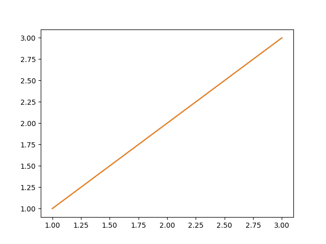
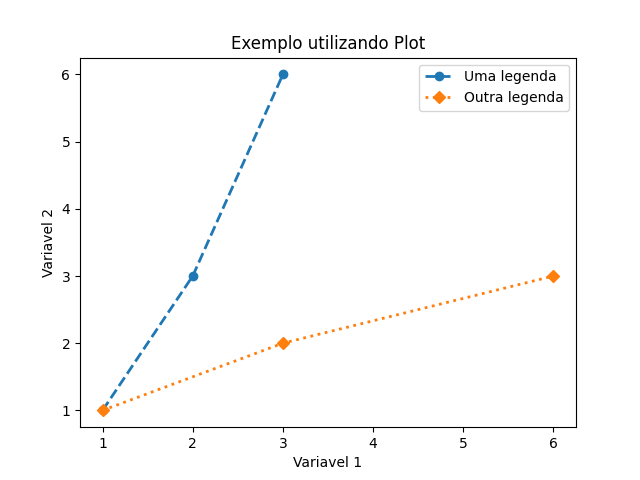

- [A biblioteca matplotlib](#a-biblioteca-matplotlib)
- [Gráfico simples](#gráfico-simples)
- [Estilizando gráficos](#estilizando-gráficos)
- [Diferentes tipos de Gráficos](#Diferentes-Tipos-de-Gráficos)
- [Salvar graficos]()
- [Referências](#referencias)

----

### A biblioteca Matplotlib

Essa biblioteca fornece funções para gerar diversos tipos de gráficos e assim visualizar informações gráficamente.

- Para usar a ferramenta, devemos primeiro, instala-la:

```python
    pip install -U matplotlib
```
<br>

Conheça melhor a biblioteca:
<a href="https://matplotlib.org/"> Site oficial do projeto</a>

### Gráfico Simples
Como dito anteriormente utilizaremos a biblioteca Matplotlib. Para criar os gráficos utilizaremos o modulo PyPlot, para utiliza-lo é necessário fazer a importação:
```python
    import matplotlib.pyplot as plt
```
Uma vez importado o pyplot como "plt", é possível criar um gráfico de forma simples como mostrado no exemplo abaixo:
```python
In[]:
    # Criando um gráfico
    plt.plot(
        [1, 2, 3], 
        [1, 3, 6]
    )
    plt.show()
```
```python
Out[]:
```
<p align ="center"></p>

Assim, criamos um gráfico simples utilizando a biblioteca matplotlib.

### Estilizando gráficos 
Aqui, veremos mais parâmetros para criar um gráficos com mais informações e mais completo.
* Com auxilio dos argumentos de palavra-chave, será possível mudar: a espessura da linha (linewidth), a estilo da linha (linestyle), marcação no ponto (marker), legenda (label)
* Para atribuir titulo ao grafico e aos eixos serão utlizadas as funções 'title' e 'xlabel/ylabel', respectivamente.

Abaixo temos um exemplo:

```python
In[]:

    # Definindo variáveis
    x = [1, 2, 3]
    y = [1, 3, 6]

    # Criando um gráfico e atribuindo etiquetas
    plt.plot(x, y, linewidth=2, linestyle='--', marker='o', label = 'Uma legenda')
    plt.plot(y, x, linewidth=2, linestyle=':', marker='D', label = 'Outra legenda')

    # Atribuindo um título ao gráfico
    plt.title('Exemplo utilizando Plot')
    plt.xlabel('Variavel 1')
    plt.ylabel('Variavel 2')

    # Aplicando legenda
    plt.legend()

    # Exibindo o gráfico gerado
    plt.show()
```

```python
Out[]:
```
<p align ="center"></p>

### Diferentes Tipos de Gráficos
#### Gráfico de Barras
* Os gráficos de barras são usados para exibir valores associados aos dados categóricos;
* A função __plt.bar()__, recebe uma lista de posições e valores;
* Os labels para *x* são fornecidos pela função __plt.xticks()__.

No exemplo a seguir será mostrado um gráfico com os 6 maiores capeões da Copa do mundo:

```python
In[]:

    import matplotlib.pyplot as plt


    plt.style.use('ggplot')

    x = ['Brasil', 'Alemanha', 'Italia', 'Argentina', 'Uruguai', 'França']
    quant = [5, 4, 4, 2, 2, 2]

    x_pos = [i for i, _ in enumerate(x)]

    plt.bar(x_pos, quant, color='green')
    plt.xlabel("Selecao")
    plt.ylabel("Copas")
    plt.title("6 maiores vencedores da Copa do Mundo")

    plt.xticks(x_pos, x)

    plt.show()
```

```python
Out[]:
```
<p align ="center"></p>

Também, podemos gerar o gráfico na horizontal, para isso basta utilizar a função _plt.barh()__:


```python
In[]:

    import matplotlib.pyplot as plt


    plt.style.use('ggplot')

    x = ['Brasil', 'Alemanha', 'Italia', 'Argentina', 'Uruguai', 'França']
    quant = [5, 4, 4, 2, 2, 2]

    x_pos = [i for i, _ in enumerate(x)]

    plt.barh(x_pos, quant, color='green')
    plt.xlabel("Seleção")
    plt.ylabel("Copas")
    plt.title("6 maiores vencedores da Copa do Mundo")

    plt.yticks(x_pos, x)

    plt.show()
```

```python
Out[]:
```
<p align ="center"></p>

#### Gráfico de Pizza
No gráfico de pizza, a área do gráfico inteiro representa 100% ou o conjunto dos dados, as partes de um gráfico de pizza são chamadas de fatias, e as fatias presentes no grafico representam a porcentagem de partes dos dados.

* Os gráficos de pizza podem ser desenhados usando a função pie() no módulo pyplot. O exemplo de código python abaixo desenha um gráfico de pizza usando a função pie().

```python
In[]:

    import matplotlib.pyplot as plt


    pieLabels = 'Asia', 'Africa', 'Europe', 'North America', 'South America', 'Australia'
    populationShare = [59.69, 16, 9.94, 7.79, 5.68, 0.54]

    figureObject, axesObject = plt.subplots()

    axesObject.pie(
        populationShare,
        labels=pieLabels,
        autopct='%1.2f',
        startangle=90
    )
    axesObject.axis('equal')
    
    plt.show()
```

```python
Out[]:
```
<p align ="center"></p>
